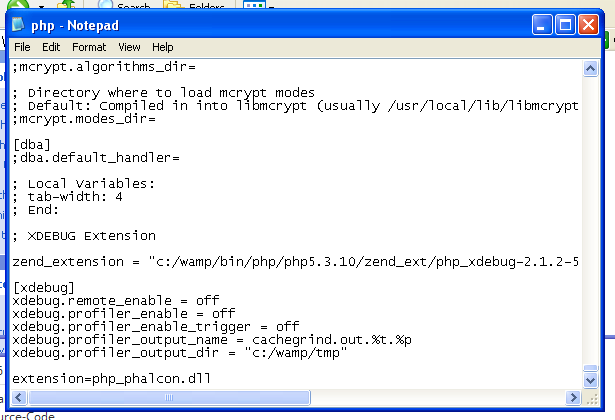
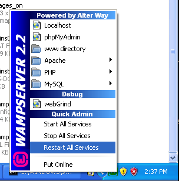

WAMP 에 설치
=====================
WampServer_ 은 Windows web 개발 환경 도구입니다.
웹 응용 프로그램을 Apache2, PHP, MySQL 로 만들 수 있습니다.
다음은 Windows 용 WampServer 을 사용하는 경우의 Phalcon 의 설치 방법을 설명 합니다.
WampServer 최신 버전을 사용 하도록 하십시오.

Phalcon 다운로드
-------------------------------------
WAMP 은 32 bit 와 64 bit 의 두 버전이 있습니다.
자신의 환경에 맞는 Windows 용 Phalcon 를 다운로드 하십시오.

Phalcon 라이브러리를 다운로드하면 다음과 같은 zip 파일이 있어야 합니다.

.. figure:: ../_static/img/xampp-1.png
    :align: center

압축파일을 해제하고 Phalcon DLL 이 있는지 확인 하십시오.

.. figure:: ../_static/img/xampp-2.png
    :align: center

PHP 확장에 php_phalcon.dll 를 복사 하십시오.
C:\\wamp folder 에 XAMPP 가 설치되어 있는 경우에 경로는 C:\\wamp\\bin\\php\\php5.3.10\\ext 로 되어 있을 것입니다.

.. figure:: ../_static/img/wamp-1.png
    :align: center

C:\\wamp\\bin\\php\\php5.3.10\\php.ini 에 있는 php.ini 파일을 텍스트 편집기로 편집합니다.
파일의 마지막에 extension=php_phalcon.dll 을 추가하고 저장합니다.
또한 C:\\wamp\\bin\\apache\\Apache2.2.21\\bin\\php.ini 여기에 php.ini 가 있을 수 있습니다.

    :align: center

Apache 를 다시 시작 합니다.

    :align: center

브라우저 에서 http://localhost 를 열면 WAMP 시작 페이지가 나타날 것입니다.
그리고, phpinfo() 링크를 클릭하여 엽니다.

.. figure:: ../_static/img/wamp-4.png
    :align: center

관련 가이드
--------------
* :doc:`General Installation </reference/install>`
* :doc:`Detailed Installation on XAMPP for Windows </reference/xampp>`

.. _WampServer: http://www.wampserver.com/en/